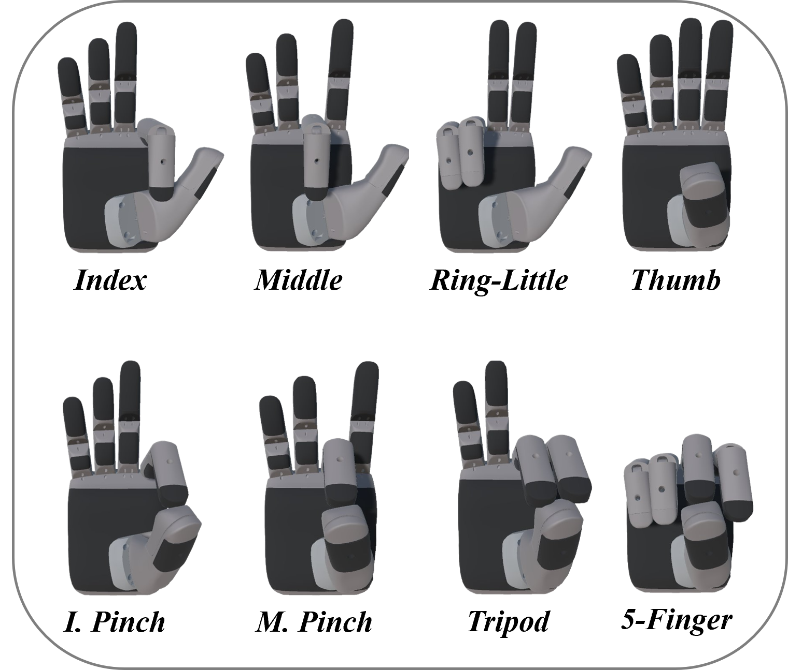

# **Dataset Description: Overview and Experimental Protocol**

The dataset comprises high-density surface electromyography (HD sEMG) recordings and hand kinematic data acquired during the execution of different motor tasks. Measurements were obtained from 21 healthy participants performing visually guided, controlled finger movements.

## Motor Tasks

The experimental protocol included eight primary movements, categorized as follows:

1. Flexion–Extension of the index finger (Index).
2. Flexion–Extension of the middle finger (Middle).
3. Coupled Flexion–Extension of the ring and little fingers (Ring-Little).
4. Opposition–Reposition of the thumb (Thumb).
5. Opening and closing of a pinch between the index finger and thumb (I. Pinch).
6. Opening and closing of a pinch between the middle finger and thumb (M. Pinch).
7. Tripod pinch involving the index, middle, and thumb (Tripod).
8. Simultaneous opening and closing of all five fingers (5-Finger).

The eight tasks were performed at two distinct frequencies (0.50 Hz and 0.75 Hz), following a sinusoidal movement pattern presented via a virtual interface. Participants were instructed to observe and replicate the visual sequences. Each experimental condition lasted 45 seconds and was repeated three times in random order. Two additional supplementary conditions were also recorded:

* **start\_position**, initial posture with the fingers extended and without hyperextension.
* **rest**, hand supported on the table in a relaxed state.

## Data Acquisition Summary

**HD sEMG Data:** For each participant, the 16 primary tasks (8 tasks × 2 frequencies) were supplemented with the start\_position and rest, for a total of 18 experimental conditions. Each condition was repeated three times, resulting in 54 HD sEMG recordings per participant.

**Kinematic Data:** The same 16 primary tasks were included, along with the start\_position condition, yielding 51 kinematic recordings per participant.

#### **Note:**

A single recording was excluded from the dataset: the second repetition of the Ring-Little task at 0.50 Hz performed by participant 017 (Sub017\_3\_05\_450\_1). Additionally, the start\_position\_0 condition was not properly recorded in the kinematic data, although it is available in the HD sEMG. Consequently, participant 017 has 53 HD sEMG and 49 kinematic files.

# **File Naming Convention**

Each file adheres to a standardized naming convention in the following format:

***Subxxx\_TaskNumber\_Frequency\_Duration\_Repetition.csv***

Within this structure, Subxxx identifies the participant, TaskNumber denotes the motor task performed (values from 1 to 8), Frequency corresponds to the execution frequency, Duration indicates the recording duration, and Repetition identifies the trial number, indexed as 0, 1, and 2. For example, Sub001\_1\_05\_450\_0.csv contains data from participant Sub001 for task 1 (index finger movement), performed at 0.50 Hz for 45 seconds in the first trial (index 0).

Regarding the supplementary conditions, files are labeled **Subxxx\_start\_position\_Repetition.csv** and **Subxxx\_rest\_Repetition.csv**, respectively, following the same trial indexing.

# **Data Organization**

Data were zipped due to storage limitation. After unzipping the dataset you will find the following organization.

The dataset is organized by participant; each folder located at the root directory corresponds to an individual subject and contains all recordings acquired during the experimental protocol. In addition, a folder named Data is provided, containing additional files that allow inspection of task randomization and review of the quality and completeness of the kinematic recordings.

## Dataset Structure

Dataset/

│

├─ Sub001/

│   ├─ HandKinematics/

│   │   ├─ Angles/

│   │   └─ Trajectories/

│   │

│   └─ HD\_sEMG/

│

├─ ...

│

└─ Sub00N/

    ├─ HandKinematics/

    │   ├─ Angles/

    │   └─ Trajectories/

    │

    └─ HD\_sEMG/

Within each Subxxx directory, two subfolders are provided: HandKinematics and HD\_sEMG. The HandKinematics folder contains kinematic data processed in Vicon, comprising joint angles estimated from the proposed biomechanical model and reconstructed three-dimensional marker trajectories. These are organized into the Angles and Trajectories subfolders, respectively. The HD\_sEMG folder groups the high-density surface electromyography recordings.

### **Additional Information**

The AddInfo folder contains two essential files in OpenDocument format (.ods):

* Task\_randomization.ods: This file documents the randomized order in which each participant performed the 18 tasks across the three experimental sets.

* Kinematic\_review.ods: This file provides a detailed overview of all kinematic recordings, specifying the finger movements performed in each task. The cells in the file use a color-coding system to indicate recording quality and may include additional notes to clarify specific situations observed during task execution or motion reconstruction. The color legend indicates the following:

| Color      | Meaning                                                                 |

|------------|-------------------------------------------------------------------------|

| Blue       | Correct and usable recording.                                            |

| Light blue | Valid recording with waveform peculiarities (e.g., peaks caused by finger repositioning). |

| Pink       | The participant’s hand was not fully open at the beginning of the recording. |

| Green      | Some movement cycles were omitted.                                       |

| Red        | Unusable recording due to incorrect task execution.                      |

The file also identifies specific frames in which markers were lost during acquisition and provides the final count of valid recordings available for each participant. The file also identifies specific frames in which markers were lost during acquisition and provides the final count of valid recordings available for each participant.

# **Preprocessing Recommendation**

Due to potential marker loss at the beginning or end of the acquisitions, it is recommended to discard the first and last 5 seconds of each recording.

## **HandKinematics/**

The HandKinematics folder contains kinematic data acquired during the execution of the motor tasks, recorded using the Vicon Nexus 2.11.0 system and subsequently preprocessed. It is organized into two subfolders, Angles and Trajectories, each containing 51 files.

### Angles/

The Angles subfolder includes joint angles (in degrees) computed using the proposed biomechanical model. The data correspond to rotation at the thumb carpometacarpal joint during opposition–reposition movements, as well as flexion–extension at the metacarpophalangeal joints of the other four fingers.

Each .csv file comprises 17 columns and 4,500 rows, representing data acquired at a 100 Hz sampling rate over a duration of 45 seconds. Regarding the columns, the first two provide the Frame and Sub Frame indices generated by the Vicon system, while the remaining 15 contain the computed joint angles, which are organized into groups of three per finger in the following order: thumb, index, middle, ring, and little. Although each group includes the X, Y, and Z axes, the X and Y values are always zero, since the Z-axis is defined as the axis of rotation in the model.

### Trajectories/

The Trajectories subfolder contains the reconstructed and preprocessed three-dimensional marker trajectories. Each .csv file comprises 4,500 rows and 38 columns, where the first two represent the Frame and Sub Frame indices, and the remaining 36 encode the X, Y, and Z position coordinates (in millimeters) of each marker.

Each finger has two markers: one on the metacarpal head (P\_f) and one on the distal phalanx at the nail (D\_f), where f denotes the first letter of the finger (T = thumb, I = index, M = middle, R = ring, L = little). Additionally, two markers are placed on the wrist: M\_W on the medial side (radial styloid) and L\_W on the lateral side (ulnar styloid).

Therefore, when opening the files in the Trajectories folder, the columns are arranged as follows: after the timing columns (Frame and Sub Frame), the X, Y, and Z coordinates appear in the order M\_W, L\_W, P\_T, D\_T, P\_I, D\_I, P\_M, D\_M, P\_R, D\_R, P\_L, D\_L, starting with the wrist markers and continuing with the thumb, index, middle, ring, and little fingers.

## **HD\_sEMG/**

The HD\_sEMG folder contains 54 files comprising high-density surface electromyography signals acquired during the motor tasks. The signals were recorded using two 8 × 8 electrode arrays positioned on the bellies of the Extensor Digitorum Communis (EDC) and Flexor Digitorum Superficialis (FDS) muscles.

Each .csv file contains 128 columns (HD sEMG channels) and 92,160 rows, sampled at 2,052.52 Hz. Although the task was designed to last 45 seconds, the recording duration is approximately 44.9 seconds. This slight difference is due to the combination of the exact sampling frequency and the requirement for an integer number of samples. Columns 1–64 belong to the electrode array on the EDC, and columns 65–128 to the array on the FDS, respectively.